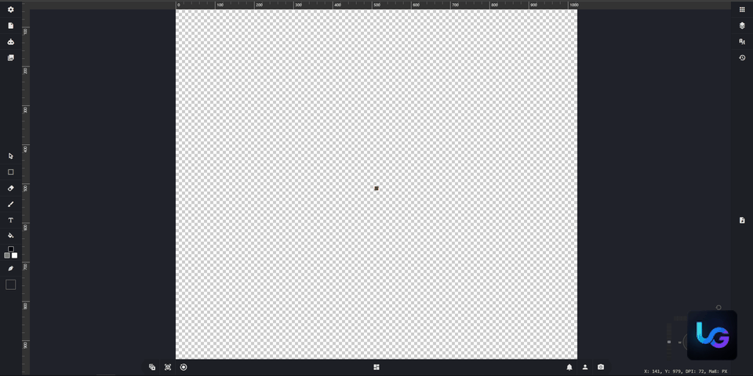

<p align="center">
  
</p>

<h1 align="center">Unity Texture Generator</h1>

<p align="center">
  Local texture, material, layer, animation, and export editor for game and 3D workflows.
</p>

## Preview



Unity Texture Generator is a local web app for creating, editing, combining, and exporting textures, layers, materials, and simple animations. The project consists of a Python/Flask backend and a Vue 3/Vuetify frontend.

## Refactor Notice

Unity Texture Generator is currently in a refactor state. Large parts of the backend, frontend, runtime structure, editor workflows, dependencies and internal project organization are being reviewed, cleaned up and refactored.

The current codebase may change significantly between versions. Existing features, APIs, routes, configuration files, generated files and editor behavior should not be considered final or stable yet.

## Absolute Warning
This app is not finished and should not be considered stable production software. The current state can be started, built, and tested locally, but it contains known limitations, development defaults, and platform-dependent dependencies.

Before a public release, at minimum, the backend configuration, secrets, portable Python dependencies, native runtime packages, frontend build, export flows, and complete editor workflows must be reviewed. Do not run it blindly in production environments.
## Project Structure

```text
Unity-Texture-Generator/
  backend/      Python/Flask API, runtime generator, assets, and CLI
  frontend/     Vue/Vuetify editor interface
  LICENSE       MIT License
  README.md     This introductory documentation
```

Additional documentation:

* [Backend README](backend/README.md)
* [Frontend README](frontend/README.md)
* [Backend CLI README](backend/cli/README.md)
* [License](LICENSE)

## Status

* App: not finished, but partially usable locally.
* Backend: starts locally as a Flask app and serves as the API for the editor, assets, rendering, exports, tasks, plugins, and AI routes.
* Frontend: builds with `npm run build` and expects a backend at `http://127.0.0.1:5000` by default.
* Release: not final yet. See the known notes in [backend/README.md](backend/README.md) and [frontend/README.md](frontend/README.md).

## Requirements

General:

* Git
* Python 3 with `venv` and `pip`
* Node.js with npm
* Sufficient disk space for Python, Node, and optional GPU/AI packages

Windows:

* PowerShell
* GTK+ 3 Runtime for Cairo/SVG/PDF-related functions
* Visual C++ Redistributable x86/x64 if Intel GPU packages are used
* NVIDIA Texture Tools if DDS/NV compression is used

Linux:

```bash
sudo apt install libcairo2
```

macOS:

```bash
brew install cairo
```

Conda/Anaconda environments:

```bash
conda install -c conda-forge cairo pango gdk-pixbuf libxml2 libffi
```

Optional Intel GPU packages:

```bash
pip install -i https://software.repos.intel.com/python/pypi dpctl dpnp
```

## Setup Order

1. Install backend dependencies.
2. Install frontend dependencies.
3. Build the frontend.
4. Start the backend.
5. Check the app in the browser at `http://localhost:5000` or `http://127.0.0.1:5000`.

## Backend Setup

Windows PowerShell:

```powershell
cd backend
python -m venv venv
.\venv\Scripts\activate
python -m pip install --upgrade pip
pip install -r requirements.txt
python app.py
```

Linux/macOS:

```bash
cd backend
python3 -m venv venv
source venv/bin/activate
python -m pip install --upgrade pip
pip install -r requirements.txt
python app.py
```

The backend starts on the following address by default:

```text
http://localhost:5000
```

Alternatively, the interactive backend CLI can be used:

```powershell
cd backend
.\venv\Scripts\activate
python cli.py
```

Important CLI commands:

* `doctor` checks release and runtime risks.
* `doctor --strict` treats warnings as error status.
* `start`, `stop`, and `restart` control the backend process.

## Frontend Setup

```bash
cd frontend
npm ci
npm run build
```

The build writes the distributable files to:

```text
frontend/dist/
```

The backend then serves the built app from `../frontend/dist/index.html`. For local frontend development, the Vue CLI service can be started directly:

```bash
cd frontend
npx vue-cli-service serve
```

Note: There is currently no `serve` script defined in `frontend/package.json`. The frontend uses the following default API:

```text
http://127.0.0.1:5000
```

If needed, the backend URL for Vue CLI can be set as follows:

```bash
VUE_APP_API_BASE_URL=http://127.0.0.1:5000
```

## Development and Build

Start the backend directly:

```bash
cd backend
python app.py
```

Frontend production build:

```bash
cd frontend
npm run build
```

Frontend lint:

```bash
cd frontend
npm run lint
```

Before a release, at least the following checks should be run:

* `python cli.py` followed by `doctor`
* `npm ci`
* `npm run build`
* Start the backend with `python app.py`
* Manual testing of upload, layer editing, modifiers, material editor, AI flow, rendering, and export

## Important Notes

* `backend/generated/` is generated on startup and should not be manually edited as the primary source.
* `backend/public/`, `backend/venv/`, `__pycache__/`, and local logs are runtime artifacts.
* `backend/requirements.txt` may contain local `file:///C:/...` references. For a portable release installation, the dependency list must be cleaned up and tested in a fresh environment.
* Backend runtime mode and CLI logging are configured in `backend/build.json`
  through `flask_mode` and `log_file`; `backend/config.json` is not required.
* Development secrets such as `SECRET_KEY` must be supplied through
  environment-specific configuration before a release.
* The frontend currently produces Sass deprecation warnings and notices about large bundles; these do not block the build, but should be taken into account.

## License

This project is licensed under the MIT License. Details can be found in [LICENSE](LICENSE).
